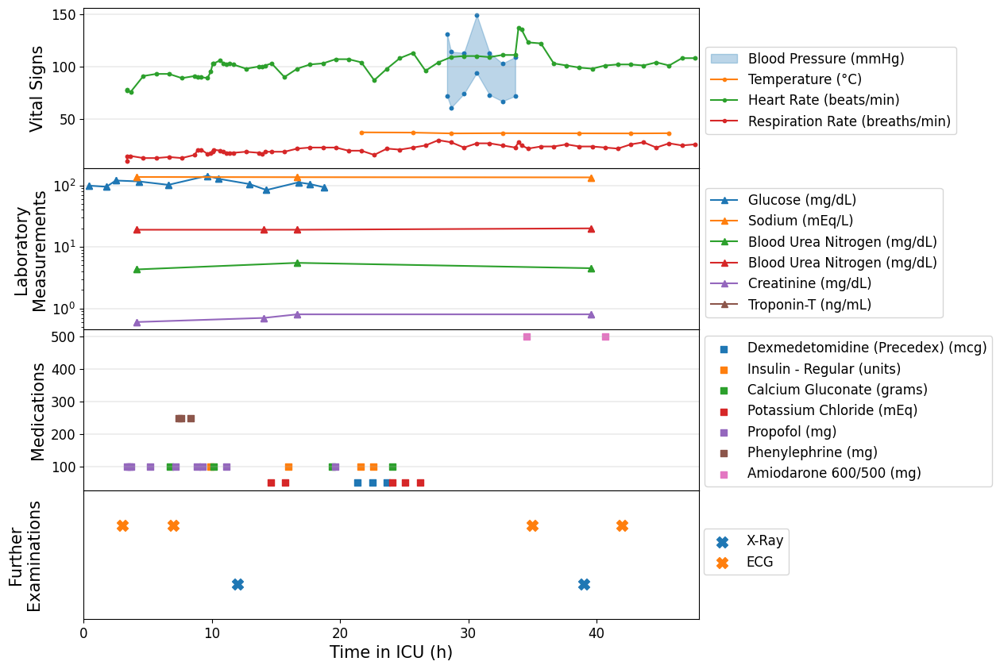

# Visual Prompt Engineering for Multimodal and Irregularly Sampled Medical Data

Malte Tölle, Mohamad Scharaf, Samantha Fischer, Christoph Reich, Silav Zeid, Christoph Dieterich, Benjamin Meder, Norbert Frey, Philipp Wild, Sandy Engelhardt

Paper link: https://arxiv.org/abs/2501.18237

## Abstract

A multitude of examinations are conducted to assess a patient's health, with each modality contributing unique information that collectively creates comprehensive understanding.
These assessments include temporal data with varying sampling rates as well as single value measurements, interventions like medications, or imaging modalities.
While physicians are able to process different information easily, neural networks need specific modeling for each modality complicating the training procedure.
We demonstrate that this complexity can be significantly reduced by visualizing all information as images along with unstructured text and subsequently training a conventional vision-text transformer.
Our approach, Vision Transformer for irregular sampled Multi-modal Measurements (ViTiMM), not only simplifies data preprocessing and modeling but also outperforms current state-of-the-art methods in predicting in-hospital mortality and phenotyping, as evaluated on 6,175 patients from the MIMIC-IV dataset.
The modalities include patient's clinical measurements, medications, X-ray images, and electrocardiography scans. % characteristics, conditions, and 
We hope our work inspires advancements in multi-modal medical AI by reducing the training complexity to (visual) prompt engineering, thus lowering entry barriers and enabling no-code solutions for training.

## Method

During a hospital stay, a patient typically undergoes multiple examinations, each offering distinct insights into their health status. While physicians have learned to intuitively extract the different information and assemble them to an overall picture, neural networks need specific modeling of the different modalities and their interactions. Nevertheless, once these challenges are addressed, multi-modal models have demonstrated promising performance. However, a significant challenge persists: How to integrate multi-modal data that is captured at irregularly sampled time intervals?



Our primary contribution is a substantial reduction of the modeling complexity for multiple irregularly sampled modalities by transforming each modality into an image representation.
Humans are then tasked with visualizing the different modalities in an informative manner, effectively engaging in a form of "visual prompt engineering".
For example, laboratory measurements can be represented as line graphs over time to convey trends and patterns (Li et al., 2023).
Our approach, **Vi**sion **T**ransformer for **i**rregular sampled **M**ulti-modal **M**easurements (**ViTiMM**), unifies the data processing pipeline, significantly reducing modeling complexity. 
This approach not only mimics the way humans interpret diverse data streams but also demonstrates significant improvements across a range of tasks.


## Results

Results of ViTiMM for the task *In-hospital Mortality* and *Phenotyping* compared to MeTra and MedFuse.  
We compare the three methods for uni-modal training for clinical measurements (C) and X-ray (X) as well as a combination of the two similar to their original publication.  
Extension of both methods to further modalities requires explicit modeling, which must not be done in ViTiMM.  
Thus, by only plotting the other modalities, our method can straightforwardly expand to arbitrary modalities.  
The results per phenotype can be found in Supplementary Table.  
The corresponding significance tests (pairwise t-test) can be found in Supplementary Tables.  

**Modalities:**  
- **C**: Clinical measurements  
- **X**: CXR images  
- **M**: Medications  
- **E**: Electrocardiography  

<table>
    <thead>
        <tr>
            <th rowspan="2">Method</th>
            <th rowspan="2">Modalities</th>
            <th colspan="3">In-hospital Mortality</th>
            <th colspan="3">Phenotyping</th>
        </tr>
        <tr>
            <th>AUROC</th>
            <th>AUPRC</th>
            <th>Bal. Acc.</th>
            <th>AUROC</th>
            <th>AUPRC</th>
            <th>Bal. Acc.</th>
        </tr>
    </thead>
    <tbody>
        <tr>
            <td rowspan="3"><b>MeTra</b></td>
            <td>C</td>
            <td>0.791</td><td>0.441</td><td>0.609</td>
            <td>0.691</td><td>0.400</td><td>0.574</td>
        </tr>
        <tr>
            <td>X</td>
            <td>0.810</td><td>0.471</td><td>0.544</td>
            <td>0.667</td><td>0.387</td><td>0.564</td>
        </tr>
        <tr>
            <td>C|X</td>
            <td>0.859</td><td>0.595</td><td>0.707</td>
            <td>0.712</td><td>0.431</td><td>0.583</td>
        </tr>
        <tr>
            <td rowspan="3"><b>MedFuse</b></td>
            <td>C</td>
            <td>0.812</td><td>0.448</td><td>0.571</td>
            <td>0.705</td><td>0.417</td><td>0.569</td>
        </tr>
        <tr>
            <td>X</td>
            <td>0.662</td><td>0.264</td><td>0.500</td>
            <td>0.640</td><td>0.349</td><td>0.538</td>
        </tr>
        <tr>
            <td>C|X</td>
            <td>0.805</td><td>0.431</td><td>0.631</td>
            <td>0.733</td><td>0.448</td><td>0.600</td>
        </tr>
        <tr>
            <td rowspan="6"><b>ViTiMM (Ours)</b></td>
            <td>C</td>
            <td>0.837</td><td>0.512</td><td>0.743</td>
            <td>0.766</td><td>0.506</td><td>0.618</td>
        </tr>
        <tr>
            <td>X</td>
            <td>0.826</td><td>0.494</td><td>0.758</td>
            <td>0.730</td><td>0.460</td><td>0.589</td>
        </tr>
        <tr>
            <td>M</td>
            <td>0.741</td><td>0.346</td><td>0.680</td>
            <td>0.710</td><td>0.430</td><td>0.577</td>
        </tr>
        <tr>
            <td>E</td>
            <td>0.704</td><td>0.297</td><td>0.636</td>
            <td>0.681</td><td>0.427</td><td>0.573</td>
        </tr>
        <tr>
            <td>C|X</td>
            <td><b>0.875</b></td><td><b>0.615</b></td><td><b>0.776</b></td>
            <td><b>0.778</b></td><td><b>0.530</b></td><td><b>0.636</b></td>
        </tr>
        <tr>
            <td>C|M|X|E</td>
            <td><b>0.922</b></td><td><b>0.764</b></td><td><b>0.847</b></td>
            <td><b>0.784</b></td><td><b>0.549</b></td><td><b>0.659</b></td>
        </tr>
    </tbody>
</table>

## Usage

After downloading the MIMIC datasets all plots can be created with the plot_[labs,ecgs,meds].ipynb files.

MIMIC-IV: https://physionet.org/content/mimiciv/3.1/

MIMIC-CXR: https://physionet.org/content/mimic-cxr-jpg/2.1.0/

MIMIC-IC-ECG: https://physionet.org/content/mimic-iv-ecg/1.0/


Place the `runs` folder in this directory, the `data` directory can have an arbitrary location.

Training can be performed with:
```
python main.py \
    --task [inhospital_mortality,phenotyping] \
    --model [swin,vit] \
    --modalities lab med cxr ecg \
    [--with_text] \
    --root PATH_TO_DATA \
    --n_epochs 3 \
    --weight_decay 3e-8 \
    --lrs 1e-5 5e-6 1e-6 \
    --batch_size 4 \
    [--ckpt PATH_TO_CKPT] \
    --seed 0
```

## BibTeX

```
@misc{toelle2025vitimm,
    title={Arbitrary Data as Images: Fusion of Patient Data Across Modalities and Irregular Intervals with Vision Transformers},
    author={T{\"o}lle, Malte and Scharaf, Mohamad and Fischer, Samantha and Reich, Christoph and Zeid, Silav and Dieterich, Christoph and Meder, Benjamin and Frey, Norbert and Wild, Philipp and Engelhardt, Sandy},
    year={2025},
    doi={10.48550/arXiv.2501.18237}
}
```

## Contact

Malte Tölle<br>
[malte.toelle@med.uni-heidelberg.de](mailto:malte.toelle@med.uni-heidelberg.de)<br>
[@maltetoelle](https://x.com/maltetoelle)<br>

Group Artificial Intelligence in Cardiovascular Medicine (AICM)<br>
Heidelberg University Hospital<br>
Im Neuenheimer Feld 410, 69120 Heidelberg, Germany